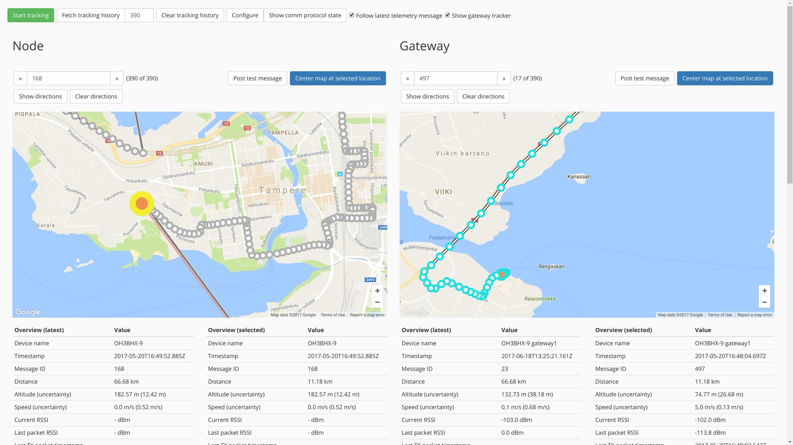
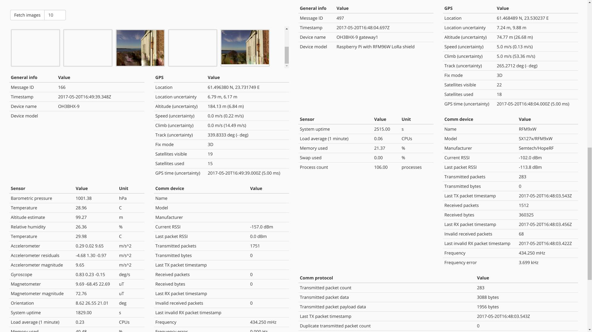

= ertgateway-ui-web

This web user interface for Embedded Radio Tracker gateway `ertgateway` is written in ES6 (JavaScript) and HTML5 using
React and Redux libraries (among many others). The code is based on `react-boilerplate` project foundation and building
the source code to files usable in a web browser requires use of Node.js, NPM and link:https://yarnpkg.com/[Yarn package manager].

*NOTE:* The web UI depends on the HTTP/WebSocket API exposed by both `ertgateway` and `ertnode`,
so it cannot be used as a standalone app.

== Installation

=== Building the code

Install basic dependencies (on Raspbian):

[source,bash]
----
sudo apt-get install git nodejs npm
----

Install link:https://yarnpkg.com/[Yarn package manager] (on Raspbian): (see link:https://yarnpkg.com/lang/en/docs/install/#linux-tab[Yarn installation instructions] for other distributions)
[source,bash]
----
curl -sS https://dl.yarnpkg.com/debian/pubkey.gpg | sudo apt-key add -
echo "deb https://dl.yarnpkg.com/debian/ stable main" | sudo tee /etc/apt/sources.list.d/yarn.list
sudo apt-get update && sudo apt-get install yarn
----

Check out source code and build it:

[source,bash]
----
git clone https://github.com/mikaelnousiainen/ertgateway-ui-web.git
cd ertgateway-ui-web

yarn install
./build-prod.sh
----

=== Installing the built files

Copy the build artifacts to `ertgateway` and/or `ertnode` static asset directory
(which defaults to `./static` in the YAML configuration):

[source,bash]
----
mkdir -p [ertgateway-build-directory]/static
cp build/* [ertgateway-build-directory]/static
----

=== Running `ertgateway` or `ertnode` with the UI

Start either `ertgateway` or `ertnode` and open a web browser with the IP address of your Raspberry Pi
and port 9000 (default): `http://x.x.x.x:9000/`.

== Usage

`ertgateway-ui-web` is a web-based user interfaces that provides access to the telemetry data messages and images
received and collected by `ertgateway`. It visualizes the current location and the location history of
both the node being tracked and the gateway used for tracking using embedded Google Maps widgets, and it displays
a complete breakdown of all data in a telemetry data message.

The UI consists of three parts, which are the global controls on the top, the node tracker view on the left,
and the gateway tracker view on the right. The global controls are used to manage the tracking mode and
the telemetry data message history available in the UI. In addition, the controls provide access to debugging views
for displaying and changing the configuration of the gateway application and for displaying the active comm
protocol streams. The tracker views on left and right should be quite self-explanatory: they display the
device locations on map and the telemetry data message contents received from the node and the gateway.

=== Tracking modes

There are two ways to use the tracker UI: a live tracking mode, where the UI updates automatically by displaying
the latest telemetry data message contents and images, or a manual mode, where the telemetry history and images can be downloaded
by clicking the respective buttons. The modes can also be combined, as it is possible to start the live tracking
mode and then download telemetry history, which is then combined with the live data received from the gateway device.
This is very useful, since the live tracking mode does not display past locations or telemetry data.

The live tracking mode is enabled by clicking the green `Start tracking` button. Once enabled, the UI is updated
automatically with the latest telemetry data messages, map location history and images received.

=== The map views

The map uses circles and two types of lines for visualizing the locations of the devices: the location history is
represented as circles with a white line connecting them and the direct path from the gateway to
the node location is drawn as red line. The circle for the most recent location is yellow and larger than
then rest of the circles, and the currently selected location is represented by a circle with orange center.
Cyan circles represent the location history for the device the map is for (= node location history in
the map for node) and grey circles are for the other device (= gateway location history in the map for node).

==== Driving directions

The `Show directions` button next to each map uses the Google Maps APIs to calculate and display
driving directions between the currently selected locations on the maps: the displayed route represents
directions from the gateway to the node. The total length of the route is also displayed.

=== Telemetry data message view

A telemetry data message view consists of six sections:

*Overview*

The overview section contains the most important data to track the location of the node and the connection quality.
The section data is displayed both for the selected message and the latest received telemetry message, which is updated
as messages are coming in.

*General*

The general section presents message and device identification details for the currently selected message.

*Location*

The location section displays raw data from GPS representing the current location and movement of the device.

*Sensors*

The section for sensors lists raw data from sensors, including descriptions and units for values.
The descriptions are absent for abbreviated telemetry data messages, because they are omitted in the data.

*Comm device*

The comm device section displays comm device data transfer statistics. The most useful values for tracking
communication link quality are signal strength (RSSI), frequency error and number of invalid packets received.

*Comm protocol*

The comm protocol section displays comm protocol data transfer statistics. Growing numbers of
retransmitted packets and packet sequence number errors indicate communication issues.

=== Browsing telemetry data message history

The telemetry data message history can be browsed by either clicking one of the circles on the map or
by clicking the arrow buttons on both sides the text field indicating the ID of the currently selected
telemetry message. Each circle indicates a recorded location of either the node or the gateway: the telemetry
data message contents related to a particular location is displayed when clicking a circle.

== License

This Source Code Form is subject to the terms of the Mozilla Public
License, v. 2.0. If a copy of the MPL was not distributed with this
file, You can obtain one at link:http://mozilla.org/MPL/2.0/[http://mozilla.org/MPL/2.0/].
